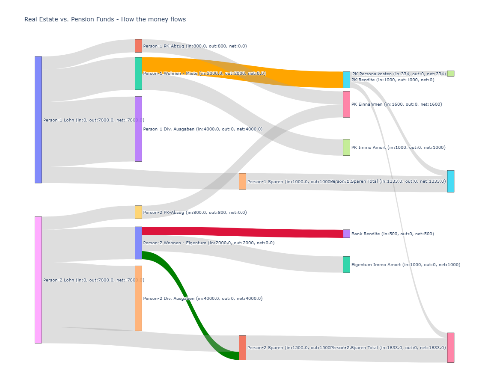

# TheVerySankeyDiagram

## Introduction

TheVerySankeyDiagram is a small Python project that visualizes how money flows between incomes, expenses, savings, and investment buckets for two people using a Plotly Sankey diagram.

## How to use

1. Install dependencies:
	- `pip install plotly`
2. Edit `persons.json` with your own people, incomes, and expenses.
	- Keep at least 2 persons.
	- Make sure each person has expense categories: `retirement`, `housing`, `living`, and `savings`.
3. Run the app:
	- `python main.py`
4. A browser window opens with the Sankey chart.

If the app fails with missing categories or fewer than 2 persons, update `persons.json` accordingly.

## Generated Diagram

